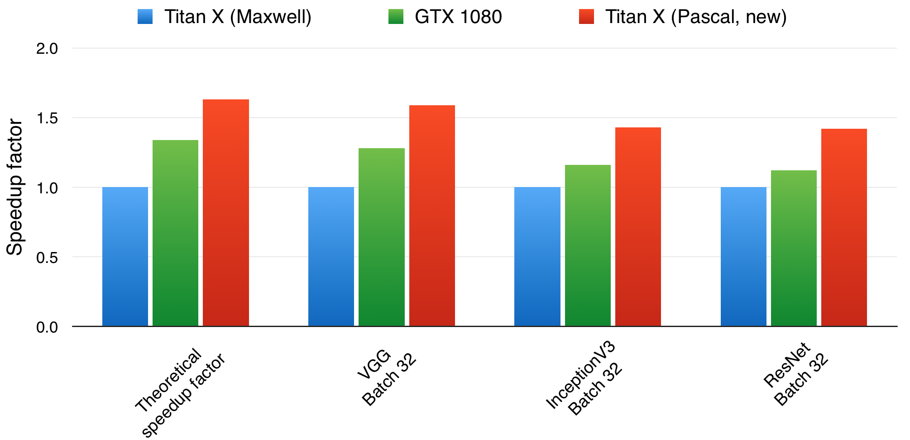

#MXNet Pascal Titan X benchmark

## Introduction

MXNet (<http://mxnet.dmlc.ml>) team has received a Pascal Titan X (2016 new version) from NVIDIA, and has benchmarked this card on popular deep learning networks in MXNet, following the deepmark protocol.

The general conclusions from this benchmark:

0. Buy new Titan X if you are rich.
1. **Pascal Titan X vs GTX 1080**: Pascal Titan X is about 1.3x faster than the GTX 1080, while its 12 GB memory allows larger batch sizes for major models, like VGG and ResNet.
2. **Pascal Titan X vs Maxwell Titan X**: generally the new Titan X is 1.4 to 1.6x faster than the old Titan X.

## Benchmark Setup

The benchmark follows deepmark protocol <https://github.com/DeepMark/deepmark>

## Build environment
nvidia-367.35, cuda 8.0, gcc 4.8.4, ubuntu 14.04, cudnn 5.0.5

## Results

### Benchmark: million second (ms) for each round (forward+backward+update)

|Card|VGG Batch 32|VGG Batch 64|InceptionV3 Batch 32|InceptionV3 Batch 64| ResNet Batch 32| ResNet Batch 64|
|---|---|---|---|---|---|---|
|Titan X (Maxwell)|499|971|372|730|307|603|
|GTX 1080|390|Out of memory*|320|Out of memory*|275|Out of memory*|
|GTX 1080 with MXNet Mirror|410|801|360|707|315|630|
|Titan X (Pascal)|314|610|260|502|216|420|

Note: our benchmark evaluates forward+backward+update time with standard networks following deepmark protocol <https://github.com/DeepMark/deepmark>, while caffe2 benchmark evaluates forward only and forward+backward with downscaled VGG and Inception networks <https://github.com/caffe2/caffe2/blob/master/caffe2/python/convnet_benchmarks.py>. These two results are not comparable.

*Due to 8 GB memory on the GTX 1080 card, batch 64 can’t run on GTX 1080. However, one can use MXNet’s memory mirror for bypassing this limit. Speed with mirror has additional cost and may bias the benchmark, so we decide to include them as an additional benchmark.

### Performance comparison: Maxwell Titan X vs GTX 1080 vs Pascal Titan X 

|Card|theoretical speedup factor|VGG Batch 32|VGG Batch 64|InceptionV3 Batch 32|InceptionV3 Batch 64| ResNet Batch 32| ResNet Batch 64|
|---|---|---|---|---|---|---|---|
|Titan X (Maxwell)|1|1|1|1|1|1|1|
|GTX 1080|1.34|1.28|N/A|1.16|N/A|1.12|N/A|
|Titan X (Pascal)|1.63|1.59|1.59|1.43|1.46|1.42|1.44|

The comparison is evaluated by “speedup factor” where the Maxwell Titan X has factor 1. The larger the factor, the faster.

#Reference

[1] ResNet: Kaiming He, Xiangyu Zhang, Shaoqing Ren, and Jian Sun. "Deep Residual Learning for Image Recognition." CVPR 2016.

[2] ResNet: Kaiming He, Xiangyu Zhang, Shaoqing Ren, and Jian Sun. "Identity Mappings in Deep Residual Networks." ECCV 2016.

[3] Inception: Christian Szegedy, Vincent Vanhoucke, Sergey Ioffe, Jonathon Shlens, Zbigniew Wojna, “Rethinking the Inception Architecture for Computer Vision” https://arxiv.org/abs/1512.00567
[4] VGG: Karen Simonyan and Andrew Zisserman. "Very Deep Convolutional Networks for Large-Scale Image Recognition." ICLR 2015

[5] Russakovsky, Olga, et al. "Imagenet large scale visual recognition challenge." International Journal of Computer Vision (2014): 1-42.

[6] Deepmark protocol <https://github.com/DeepMark/deepmark>

[7] Caffe2 benchmark table and source code
<https://docs.google.com/spreadsheets/d/1nPup-R9muaPvw_ap4MQnH3xgQIT78xy-GLxrQmknbtM/htmlview#gid=0> , <https://github.com/caffe2/caffe2/blob/master/caffe2/python/convnet_benchmarks.py>

[8] Some other benchmark example
https://github.com/jcjohnson/cnn-benchmarks